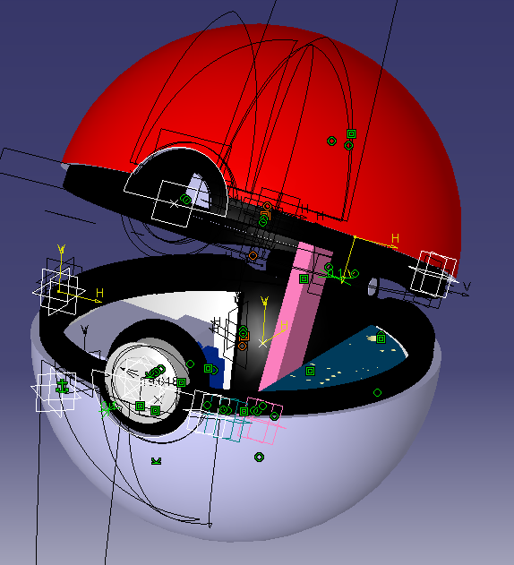

# Pokéball Mechatronic System

A complete **mechatronic project** combining **mechanical design**, **electronics**, and **embedded software** to create a **3D-printed Pokéball that opens and closes at the press of a button** using a servo motor.

  
  
  

  <em>PCB design — 3D printed mechanical parts — Functional open/close animation</em>

---

## Project Motivation

This project was driven by the desire to build a **real, functional object** that combines:
- mechanical design
- electronics design
- embedded programming  

The Pokéball was chosen as a **compact, recognizable, and mechanically interesting object**, requiring:
- precise tolerances
- reliable actuation
- low-power embedded control  

The goal was not only to make it work, but to make it **manufacturable, reproducible, and cleanly documented**.

---

## System Overview

The system is composed of:
- A **3D-printed mechanical assembly** allowing smooth opening and closing
- A **custom PCB** powered by a rechargeable battery
- An **embedded microcontroller** controlling a servo motor
- A **push button** used as the user interface

### Functional principle
1. The system is powered by a rechargeable battery  
2. Voltage is boosted from **3.3 V to 5 V**
3. When the button is pressed:
   - the microcontroller toggles its state
   - the servo motor actuates
   - the Pokéball opens or closes accordingly

---

## Design & Development Approach

### Mechanical Design
- Designed entirely in: **CATIA V5**
- Assembly-driven design to validate motion and clearances
- Parts exported and tested for **FDM 3D printing**
- Tolerances adjusted through real-world testing

### Electronics
- PCB designed using: **EasyEDA**
- PCB manufactured by: **JLCPCB**
- Battery-powered system with onboard charging via USB-C
- Voltage regulation and boosting for servo compatibility

### Embedded Software
- Firmware written for an: **ATtiny85**
- Manual PWM generation for servo control
- Button debouncing and state toggling
- Simple, deterministic logic adapted to low-resource hardware

