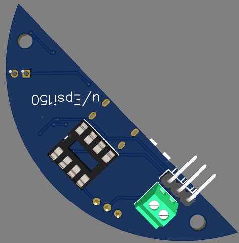

# PCB – Design & Manufacturing Notes

## PCB Design
The PCB was designed using :EasyEDA.
The schematic and layout were fully completed, verified, and prepared for manufacturing.

## Manufacturing
The PCB was ordered and manufactured by :JLCPCB.

## Folder Structure
This directory contains the following subfolders:
- **/3D** → 3D files of the PCB (STEP / 3D visualization)
- **/Gerber** → Gerber files ready for manufacturing
- **/BOM_PnP** → CSV files for:
  - Bill of Materials (BOM)
  - Pick and Place (PnP)

## PCB Overview
The board is powered by a **3.3 V battery**, which is **boosted to 5 V** for the required components.
- Battery charging is handled through a **USB-C port**
- An **:ATtiny85** is used as the main controller
- A **servo motor** is controlled to open and close the Pokéball
- The action is triggered by a **push button**

## Functional Description
1. The PCB is powered from a rechargeable battery  
2. Voltage is boosted from 3.3 V to 5 V  
3. When the push button is pressed:
   - the ATtiny85 processes the input
   - the servo motor is actuated
   - the Pokéball opens or closes accordingly

## PCB Views

### 2D View                               

### 3D Top View

### 3D Bottom View

